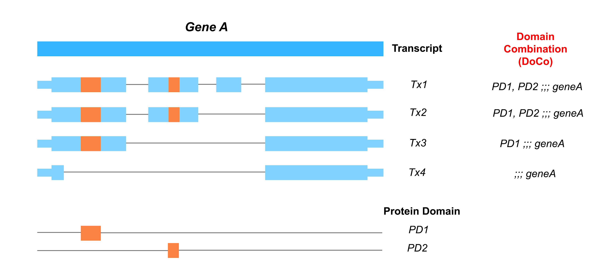

# longhaul (in development)

**longhaul** is a multi-purpose R package developed by the Davidson Lab. It is designed to facilitate various bioinformatics analyses focusing on long-read RNA-Seq via its component modules. 

## Table of Contents

- [Dependencies](#dependencies)
- [Installation](#installation)
- [Overview](#overview)
- [Modules](#modules)
  - [blessy](#blessy)
    - [Quick Use](#quick-use) 
    - [General Use](#general-use)  
    - [Custom Use](#custom-use)
    - [Functions and Use Cases](#functions-and-use-cases)
- [License](#license)
- [Contact](#contact)


## Dependencies
The longhaul package requires several dependencies from both CRAN and Bioconductor to function properly. It is important to note that longhaul is compatible with R version 4.4 or higher, as some dependencies, such as UCSC.utils, may not run on older versions of R. Additionally, please ensure compatibility with the current Bioconductor version.

### Installing Dependencies

Before installing longhaul, ensure your R installation is version 4.4 or later. You can check your R version by running R.version.string in your R console.

```R
# Check R version
R.Version()$version.string  # Ensure R version 4.4 or higher
```

To install the required dependencies, follow these steps:

### Install Core Dependencies from CRAN

These packages are available directly from CRAN and can be installed using the standard install.packages method.

```R
# Install core dependencies from CRAN
install.packages(c("dplyr", "tidyr"))
```
### Install Bioconductor Dependencies

Packages from Bioconductor require the BiocManager for installation. 

```R
# Install BiocManager if not already installed
if (!requireNamespace("BiocManager", quietly = TRUE))
    install.packages("BiocManager")

# Install packages from Bioconductor
BiocManager::install(c("GenomicRanges", "UCSC.utils", "rtracklayer"))

```
### Bioconductor Version
```R
# Check Bioconductor version
BiocManager::version()

# Install the latest version of Bioconductor if needed
BiocManager::install(version = "3.20")

```

## Installation

You can install the **longhaul** package from GitHub using the `devtools` package:

```R
# Install devtools if you haven't already
install.packages("devtools")

# Install longhaul from GitHub
devtools::install_github("DavidsonGroup/longhaul")
```

## Overview

**longhaul** is a comprehensive toolkit intended to streamline various computational biology workflows within the Davidson Lab. It encompasses multiple modules, each tailored to specific tasks in long-read RNA-Seq analysis.

The **longhaul** package includes the following modules:

- blessy: a tool for differential analysis on phased protein domains.


## Modules

### blessy 

*blessy* is a module within the longhaul package for performing differential analysis on a novel genomic feature termed 'Domain Combination'
or 'DoCo' for short. 

In the figure below, the hypothetical gene A has 4 transcripts (Tx1, Tx2, Tx3, Tx4). On each transcript, regions that encode for protein domains (PD1, PD2) can be found. Transcripts with the similar domain phasing are categorized into the same 'Domain Combination' or 'DoCo' group. DoCo class is then considered per gene, making DoCo an intermediate feature of gene and transcript. Of note, transcripts with no domain (Tx4) are still categorized into an ‘empty’ DoCo group (;;; geneA).

The DoCo class can be used to check and group transcripts of an existing RNA-Seq count. Besides making transcript groups with equivalent biology, the count of each DoCo is the aggregated count of its component transcripts, addressing the previous issue of low count per feature in differential transcript analyses such as DTE or DTU. 



#### Quick use
*blessy* performs two major tasks: creating a DoCo class, and aggregating transcript count based on created DoCo class. *blessy* requires UCSC identifiers for transcript and domain annotations along with their assembly identifier, and a transcript count. Please ensure that the transcript ID in the count file is compatible with that of the transcript annotation. The basic use of *blessy* is as follows:

```R
# Load library
library(longhaul)

# Run blessy
blessy_results <- blessy(genomeAssembly, transcriptAnnotation, domainAnnotation, transcriptCount)

# View the DoCo class created from chosen annotations 
DoCo_class <- blessy_results$phasing_dict

# View the DoCo count created from aggregated transcript count
DoCo_count <- blessy_results$doco_count

```

Please see the package's [wiki](https://github.com/DavidsonGroup/longhaul/wiki) for detailed usage instruction and worked examples.


<hr style="border: 1px solid #000;">


