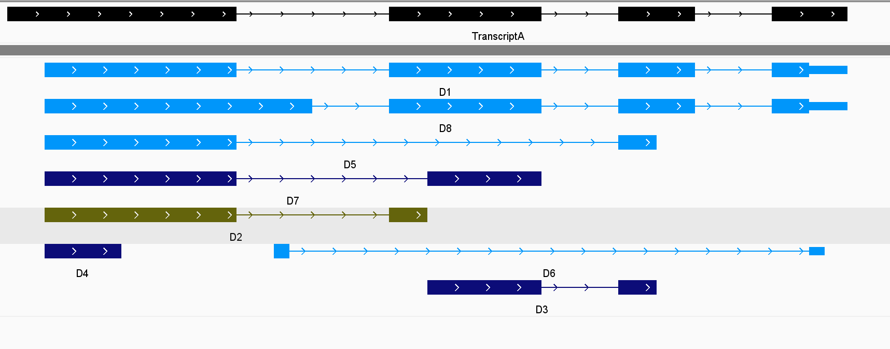

# longhaul

**longhaul** is a multi-purpose R package developed by the Davidson Lab. It is designed to facilitate various bioinformatics analyses focusing on long-read RNA-Seq via its component modules. 

## Table of Contents

- [Dependencies](#dependencies)
- [Installation](#installation)
- [Overview](#overview)
- [Modules](#modules)
  - [blessy](#blessy)
    - [Quick Use](#quick-use) 
    - [General Use](#general-use)  
    - [Custom Use](#custom-use)
    - [Functions and Use Cases](#functions-and-use-cases)
- [License](#license)
- [Contact](#contact)


## Dependencies
The longhaul package requires several dependencies from both CRAN and Bioconductor to function properly. It is important to note that longhaul is compatible with R version 4.4 or higher, as some dependencies, such as UCSC.utils, may not run on older versions of R. Additionally, please ensure compatibility with the current Bioconductor version.

### Installing Dependencies

Before installing longhaul, ensure your R installation is version 4.4 or later. You can check your R version by running R.version.string in your R console.

```R
# Check R version
R.Version()$version.string  # Ensure R version 4.4 or higher
```

To install the required dependencies, follow these steps:

### Install Core Dependencies from CRAN

These packages are available directly from CRAN and can be installed using the standard install.packages method.

```R
# Install core dependencies from CRAN
install.packages(c("dplyr", "tidyr"))
```
### Install Bioconductor Dependencies

Packages from Bioconductor require the BiocManager for installation. 

```R
# Install BiocManager if not already installed
if (!requireNamespace("BiocManager", quietly = TRUE))
    install.packages("BiocManager")

# Install packages from Bioconductor
BiocManager::install(c("GenomicRanges", "UCSC.utils"))

```
### Bioconductor Version
```R
# Check Bioconductor version
BiocManager::version()

# Install the latest version of Bioconductor if needed
BiocManager::install(version = "3.20")

```

## Installation

You can install the **longhaul** package from GitHub using the `devtools` package:

```R
# Install devtools if you haven't already
install.packages("devtools")

# Install longhaul from GitHub
devtools::install_github("DavidsonGroup/longhaul")
```

## Overview

**longhaul** is a comprehensive toolkit intended to streamline various computational biology workflows within the Davidson Lab. It encompasses multiple modules, each tailored to specific tasks in long-read RNA-Seq analysis.

The **longhaul** package includes the following modules:

- blessy: a tool for differential analysis on phased protein domains.


## Modules

### blessy 

*blessy* is a module within the longhaul package for performing differential analysis on a novel genomic feature termed 'Domain Combination'
or 'DoCo' for short. 

In the figure below, the hypothetical gene A has 4 transcripts (Tx1, Tx2, Tx3, Tx4). On each transcript, regions that encode for protein domains (PD1, PD2) can be found. Transcripts with the similar domain phasing are categorized into the same 'Domain Combination' or 'DoCo' group. DoCo class is then considered per gene, making DoCo an intermediate feature of gene and transcript. Of note, transcripts with no domain (Tx4) are still categorized into an ‘empty’ DoCo group (;;; geneA).

The DoCo class can be used to check and group transcripts of an existing RNA-Seq count. Besides making transcript groups with equivalent biology, the count of each DoCo is the aggregated count of its component transcripts, addressing the previous issue of low count per feature in differential transcript analyses such as DTE or DTU. 


#### Quick use
*blessy* performs two major tasks: creating a DoCo class, and aggregating transcript count based on created DoCo class. *blessy* requires UCSC identifiers for transcript and domain annotations along with their assembly identifier, and a transcript count. Please ensure that the transcript ID in the count file is compatible with that of the transcript annotation. The basic use of *blessy* is as follows:

```R
# Run blessy
blessy_results <- blessy(genomeAssembly, transcriptAnnotation, domainAnnotation, transcriptCount)

# View the DoCo class created from chosen annotations 
DoCo_class <- blessy_results$phasing_dict

# View the DoCo count created from aggregated transcript count
DoCo_count <- blessy_results$doco_count

```

NOTE: The transcript and domain annotation UCSC identifiers correspond to the values inside the 'Table' option, and assembly identifier can be found within 'Assembly' [of the UCSC Table Browser](https://genome.ucsc.edu/cgi-bin/hgTables). To see a valid example, please refer to the General Use below.

============================================================================================
<br> 

#### General Use

*blessy* performs two tasks: 

1. Create the DoCo class 

*blessy* takes in a transcript and a domain annotation, and map domains to each transcript they belong to based on genomic coordinates provided by the provided annotations. Next, irrelevant mappings are filtered. *blessy* then checks for the domain phasing and the gene of each transcript to categorize the transcripts into different DoCo groups. Finally, *blessy* summarizes the hierarchical order of gene, DoCo and transcript into a phasing dictionary. 

2. Aggregate transcript count to DoCo count

Once the information of the DoCo class is generated, *blessy* aggregate transcripts within a provided count into the DoCo-level count by matching the Transcript ID from the built dictionary and the given count. 

<br> 
Based on these tasks, the wrapper function of *blessy* requires transcript and protein domain annotations to create the DoCo class. The default mode of *blessy* uses annotation identifiers of the UCSC Genome Browser, along with their assembly identifier. Additionally, an RNA-Seq transcript count must be provided for aggregating count at transcript-level to DoCo-level, once the information on DoCo class is generated. 

<br> 

```R
# Wrapper function for blessy
blessy_outs <- blessy(genomeAssembly, transcriptAnnotation, domainAnnotation, transcriptCount)

# Accessing the DoCo class dictionary
doco_class <- blessy_outs$phasing_dict

# Accessing the DoCo count
doco_count <- blessy_outs$doco_count
```

**genomeAssembly** - A string specifying the UCSC assembly identifier used for the two transcriptAnnotation and domainAnnotation below. This string corresponds to the identifier which can be found at the end of the 'Assembly' option in the [UCSC Table Browser](https://genome.ucsc.edu/cgi-bin/hgTables), or the 'Database' seen in the 'Data format description' page of a specific track. (e.g., "hg38").

**transcriptAnnotation** - A string specifying the UCSC table identifier of a transcript track. This string corresponds to the 'Table' option in the [UCSC Table Browser](https://genome.ucsc.edu/cgi-bin/hgTables), or the 'Primary Table' seen in the 'Data format description' page of a specific track. (e.g., "wgEncodeGencodeBasicV44"). 

**domainAnnotation** - A string specifying the UCSC table identifier of a domain track. This string corresponds to the 'Table' option in the [UCSC Table Browser](https://genome.ucsc.edu/cgi-bin/hgTables), or the 'Primary Table' seen in the 'Data format description' page of a specific track. (e.g., "unipDomain").

**transcriptCount** - An R data frame containing RNA-Seq transcript count. The first column must be named 'TranscriptID' storing string values of transcript identifiers, and the IDs must be compatible with what found in transcriptAnnotation. Other columns are considered numeric count across different biological samples.

NOTE: We highly recommend using the GENCODE or NCBI RefSeq tracks for transcript annotation and UniProt or Pfam tracks for domain annotation, as *blessy* is tailored around these annotations.

[FOR DEMONSTRATION OF FULL WORKING EXAMPLE, AND WHAT TO DO WITH THE OUTPUT (EDGER)] 


#### Custom use 

*blessy* includes the blessy.usingCustomAnnotation() function that works on custom or user-provided annotations in scenarios such as:

1. Use multiple tracks for transcript or domain annotations

*blessy* allows users to provide their own annotation tracks of choice, leaving room for annotation customization. For example, users can choose to retrieve multiple domain annotation tracks via blessy.getDomainTrack() (see [Functions and Use Cases](#functions-and-use-cases)), and integrate these domain tracks into one comprehensive domain annotation using simple R commands:

```R


# Fetch domain tracks on the UCSC Genome Browser
unipDomain <- blessy.getDomainTrack("hg38", "unipDomain")
unipInterest <- blessy.getDomainTrack("hg38", "unipInterest")

# Combine the two data frames
combined_df <- bind_rows(unipDomain, unipInterest)

# Filter out rows containing "Disordered"
filtered_df <- combined_df %>% 
  filter(!grepl("Disordered", name)) 

# Sort 
domain_df <- filtered_df %>% 
  arrange(chrom, chromStart) 

# Perform blessy
blessy_outs_custom <- blessy.usingCustomAnnotation()

```

2. Use user-provided annotation data frame

To run *blessy* using annotations **NOT** from UCSC, users must ensure that these annotations are first read into BED-like R data frames. These data frames must include the following columns:

**chrom**- Chromosome or scaffold name of the feature.

**chromStart** - Start coordinate on the chromosome or scaffold for the feature considered.

**chromEnd** - End coordinate on the chromosome or scaffold for the feature considered.

**blockCount** - Number of blocks (exon for transcripts, domain-block for domains) on the line of the BED-like data frame.

**blockSizes** - List of values separated by commas corresponding to the size of the blocks (the number of values must correspond to that of the 'blockCount').

**blockStarts** - List of values separated by commas corresponding to the starting coordinates of the blocks, coordinates calculated relative to those present in the chromStart column (the number of values must correspond to that of the 'blockCount').

**thickStart** - **(for transcript only)** Start coordinate of the coding sequence of the transcript.

**thickEnd** - **(for transcript only)** End coordinate of the coding sequence of the transcript.

**geneName** - **(for transcript only)** Identifier of the gene the transcript belongs to.


*blessy* can then use these annotations to define the DoCo class and aggregate the provided transcript count:

```R
blessy_outs_custom <- blessy.usingCustomAnnotation(customTranscriptAnnotation, customDomainAnnotation, transcriptCount)
```

**customTranscriptAnnotation** - A BED-like data frame representing transcript annotation of the required format. 

**customDomainAnnotation** - A BED-like data frame representing domain annotation of the required format. 

**transcriptCount** - An R data frame containing RNA-Seq transcript count. The first column must be named 'TranscriptID' storing string values of transcript identifiers. Other columns are considered numeric count across different biological samples.

3. Use user-provided GRangesList objects: 

*blessy* works with GRangesList objects storing transcript and domain annotations. 

<br>

#### Functions and Use Cases:
Here, we outline the component functions of blessy along with use-cases and arguments for each, to assist users in customizing the module to fit their specific needs. The functions are listed based on their order in the blessy pipeline:

<div align="center">

| Function       | Description                                      |
|----------------|--------------------------------------------------|
| blessy.getTranscriptTrack | Fetch transcript-type annotation tracks from the UCSC database. |
| blessy.getDomainTrack | Fetch domain-type annotation tracks UCSC database. |
| blessy.dfToGRangesList| Convert BED-like R data frame to GRangesList. |
| blessy.mapDomainToTranscript | Create a data frame of domains mapped to transcripts. |
| blessy.addStartsEnds | Add important coordinates columns for domain deduplication. |
| blessy.domainDeduplication | Remove non-exact domain mappings. |
| blessy.domainPhasing | Create a 'DoCo' column based on domain phasing. |
| blessy.createPhasingDictionary | Summarize gene, DoCo and transcript levels from given annotations. |
| blessy.createDoCoCount | Aggregate given transcript count to DoCo level. |

</div>

##### Fetch Annotation Tracks: blessy.getTranscriptTrack(genomeAssembly, transcriptAnnotation) and blessy.getDomainTrack(genomeAssembly, domainAnnotation)
The purpose of these two functions is for retrieving UCSC annotations. As transcript and domain tracks often have different syntax on the UCSC Database, each function is designed to a different track type. Both functions require two arguments: an assembly identifier and an annotation identifier, which correspond to the 'Assembly' and 'Table' options in the [UCSC Table Browser](https://genome.ucsc.edu/cgi-bin/hgTables) respectively. Again, we highly recommend using the GENCODE or NCBI RefSeq tracks for transcript annotation and UniProt or Pfam tracks for domain annotation. The output of blessy.getTranscriptTrack() and blessy.getDomainTrack() are annotations stored in BED-like R data frames.

```R
# Fetch annotation tracks
transcript_annotation <- blessy.getTranscriptTrack("hg38", "wgEncodeGencodeBasicV44")
domain_annotation <- blessy.getDomainTrack("hg38", "unipDomain")

# Output visualization
> head(transcript_annotation)
  chrom chromStart  chromEnd              name score strand thickStart  thickEnd itemRgb blockCount
1  chr1   67092164  67134970 ENST00000684719.1     0      -   67093004  67127240   0,0,0          8
2  chr1   67092164  67231852 ENST00000371007.6     0      -   67093004  67127240   0,0,0          8
3  chr1   67092175  67127261 ENST00000371006.5     0      -   67093004  67127240   0,0,0          6
4  chr1   67092175  67127261 ENST00000475209.6     0      -   67093579  67127240   0,0,0          7
5  chr1   67092396  67127261 ENST00000621590.4     0      -   67096311  67127240   0,0,0          3
6  chr1  201283451 201332993 ENST00000263946.7     0      +  201283702 201328836   0,0,0         15

```


##### Convert BED-like R Data Frame to GRangesList: blessy.dfToGRangesList(annotation_df)

blessy.dfToGRangesList takes in a BED-like annotation data frame and convert it into a big GRanges object, based on the columns 'chrom', 'chromStart', 'chromEnd', and 'strand'. Next, this single GRanges objects will be splitted into a GRangesList where each GRanges object correspond to a transcript or a domain in the initial annotation using this function.

```R
# Example BED-like annotation data frame
transcript_annotation <- data.frame(
  chrom = c("chr1", "chr1", "chr2"),
  chromStart = c(1000, 2000, 3000),
  chromEnd = c(1500, 2500, 3500),
  name = c("tx1", "tx2", "tx3"),
  strand = c("+", "-", "+"),
  thickStart = c(1000, 2000, 3000),
  thickEnd = c(1500, 2500, 3500),
  blockCount = c(2, 2, 2),
  blockSizes = c("100,200", "150,250", "200,300"),
  blockStarts = c("0,400", "0,500", "0,600"),
  geneName = c("geneA", "geneB", "geneC"),
  stringsAsFactors = FALSE
)

# Convert the data frame to a GRangesList
transcript_GRL <- blessy.dfToGRangesList(transcript_annotation)

# Output visualization
> head(transcript_GRL)

GRangesList object of length 3:
$`1`
GRanges object with 1 range and 7 metadata columns:
      seqnames    ranges strand |        name thickStart  thickEnd blockCount  blockSizes blockStarts    geneName
         <Rle> <IRanges>  <Rle> | <character>  <numeric> <numeric>  <numeric> <character> <character> <character>
  [1]     chr1 1000-1500      + |         tx1       1000      1500          2     100,200       0,400       geneA
  -------
  seqinfo: 2 sequences from an unspecified genome; no seqlengths

$`2`
GRanges object with 1 range and 7 metadata columns:
      seqnames    ranges strand |        name thickStart  thickEnd blockCount  blockSizes blockStarts    geneName
         <Rle> <IRanges>  <Rle> | <character>  <numeric> <numeric>  <numeric> <character> <character> <character>
  [1]     chr1 2000-2500      - |         tx2       2000      2500          2     150,250       0,500       geneB
  -------
  seqinfo: 2 sequences from an unspecified genome; no seqlengths

$`3`
GRanges object with 1 range and 7 metadata columns:
      seqnames    ranges strand |        name thickStart  thickEnd blockCount  blockSizes blockStarts    geneName
         <Rle> <IRanges>  <Rle> | <character>  <numeric> <numeric>  <numeric> <character> <character> <character>
  [1]     chr2 3000-3500      + |         tx3       3000      3500          2     200,300       0,600       geneC
  -------
  seqinfo: 2 sequences from an unspecified genome; no seqlengths

```

##### Map Domain to Transcript: blessy.mapDomainToTranscript(transcript_GRL, domain_GRL, transcript_annotation, domain_annotation)
This function serves to map the domains that intersect each transcript based on genomic coordinates. The function takes in the two GRangesLists of domain and transcript, and find their coordinate overlaps using the findOverlaps() function of GenomicRanges. findOverlaps() returns index pairs of matching domains and transcripts, which is used to join columns of the initial transcript and domain annotations based on matching features. The return object of this function is a mapping data frame with information on transcript and its matched domains.

```R
# Example BED-like annotation data frames
transcript_annotation <- data.frame(
  chrom = c("chr1", "chr1", "chr2"),
  chromStart = c(1000, 2000, 3000),
  chromEnd = c(1500, 2500, 3500),
  name = c("tx1", "tx2", "tx3"),
  strand = c("+", "-", "+"),
  thickStart = c(1000, 2000, 3000),
  thickEnd = c(1500, 2500, 3500),
  blockCount = c(2, 2, 2),
  blockSizes = c("100,200", "150,250", "200,300"),
  blockStarts = c("0,400", "0,500", "0,600"),
  geneName = c("geneA", "geneB", "geneC"),
  stringsAsFactors = FALSE
)


domain_annotation <- data.frame(
  chrom = c("chr1", "chr1", "chr2"),
  chromStart = c(1200, 2100, 3100),
  chromEnd = c(1300, 2200, 3200),
  name = c("domainA", "domainB", "domainC"),
  strand = c("+", "-", "+"),
  blockStarts = c("0", "0", "0"),
  blockSizes = c("100", "100", "100"),  # Assuming block size is 100 for each domain
  stringsAsFactors = FALSE
)

# Convert to GRangesList
tx_grangesList <- blessy.dfToGRangesList(transcript_annotation)
domain_grangesList <- blessy.dfToGRangesList(domain_annotation)

# Create domain mapping 
mapping_df <- blessy.mapDomainToTranscript(tx_grangesList, domain_grangesList, transcript_annotation, domain_annotation)

# Output visualization
> head(mapping_df)
  chrom txStart txEnd Transcript strand cdsStart cdsEnd exonCount exonSizes exonRelativeStarts  Gene chromStart chromEnd  Domain
1  chr1    1000  1500        tx1      +     1000   1500         2   100,200              0,400 geneA       1200     1300 domainA
2  chr1    2000  2500        tx2      -     2000   2500         2   150,250              0,500 geneB       2100     2200 domainB
3  chr2    3000  3500        tx3      +     3000   3500         2   200,300              0,600 geneC       3100     3200 domainC
  chromStarts blockSizes
1           0        100
2           0        100
3           0        100
```

##### Add Block Coordinates to Mapping Data Frame: blessy.addStartsEnds(mapping_df)
This function adds several columns needed for the domain deduplication process to the input mapping data frame, based on existing columns. More specifically, this functions creates exonStarts and exonEnds columns corresponding to the start and end genomic coordinates of exons within a transcript, and likewise for its domains with blockStarts and blockEnds. 

```R
# Example mapping data frame
mapping_df <- data.frame(
  txStart = c(1000, 2000),
  exonRelativeStarts = c("0,100,200", "0,50,100"),
  exonSizes = c("100,50,25", "80,40,30"),
  chromStart = c(1000, 2000),
  chromStarts = c("0,150,300", "0,100,200"),
  blockSizes = c("100,50,25", "80,40,30")
)

# Add block coordinates
mapping_df <- blessy.addStartsEnds(mapping_df)

# Output visualization
> head(mapping_df)
  txStart exonRelativeStarts exonSizes chromStart chromStarts blockSizes     exonStarts       exonEnds
1    1000          0,100,200 100,50,25       1000   0,150,300  100,50,25 1000,1100,1200 1100,1150,1225
2    2000           0,50,100  80,40,30       2000   0,100,200   80,40,30 2000,2050,2100 2080,2090,2130
     blockStarts      blockEnds
1 1000,1150,1300 1100,1200,1325
2 2000,2100,2200 2080,2140,2230

```

##### Domain Mapping Deduplication: blessy.domainDeduplication()
While the blessy.mapDomainToTranscript function allows for finding coordinate overlaps between domains and transcripts, non-exact matches that incorrectly assigns a domain to a transcript can happen. In the figure below, given a hypothetical transcript A, only domain 1 to domain 4 (D1-D4) should be considered correct matches for transcript A. For D5, we observe a non-consecutive exon match. The first D6 block does not align to an exon and while both blocks aligns with consecutive exons, the second block of D7 exhibited a gap to the left-hand side. Similarly, first block alignment of D8 showed overflown. The blessy.domainDeduplication function thus aims to remove D5 to D8 from this hypothetical domain-transcript mapping, using the 'exonStarts', 'exonEnds', 'blockStarts', 'blockEnds' columns created by blessy.addStartsEnds.



These hypothetical transcripts and domains have been converted to BED files, which can be found as data/example_domains.bed or data/example_transcript.bed. By default, we expect D1, D2, D3 and D4 to remain after deduplication. The use case for this process is as follows:

```R
# Read and rename hypothetical transcript A BED into an R BED-like data frame
tx_df <- read.table("example_transcript.bed")
colnames(tx_df) <- c("chrom", "chromStart", "chromEnd", "name", "score", "strand",
                        "thickStart", "thickEnd", "itemRgb", "blockCount", "blockSizes", "blockStarts", "geneName")

# Read and rename hypothetical domains BED into an R BED-like data frame
domain_df <- read.table("example_domains.bed")
colnames(domain_df) <- c("chrom", "chromStart", "chromEnd", "name", "score", "strand",
                     "thickStart", "thickEnd", "itemRgb", "blockCount", "blockSizes", "blockStarts")

# Convert dataframes to GRanges object
tx_grangesList <- blessy.dfToGRangesList(tx_df)
domain_grangesList <- blessy.dfToGRangesList(domain_df)
  
# Map domains to transcripts
mapped_df <- blessy.mapDomainToTranscript(tx_grangesList, domain_grangesList, tx_df, domain_df)
  
# Add exon and block starts/ends
starts_ends_df <- blessy.addStartsEnds(mapped_df)
  
# Deduplicate domain mappings
deduplicated_df <- blessy.domainDeduplication(starts_ends_df)

> unique(deduplicated_df$Domain)
[1] "D1" "D2" "D3" "D4"
```

##### Domain Phasing: blessy.domainPhasing(mapping_df)
The blessy.domainPhasing() generates the DoCo string of transcripts with matched domains and includes them to the input mapping data frame. The function iterates through the domains in each transcript based on their coordinates and strand direction, and output the DoCo string in a new 'DoCo' column. [FUTURE WORK]: The function offers the option to either include genomic coordinates of each domain in the DoCo string or not, affecting the number of DoCo class for transcript aggregation. 

```R
# Example domain mapping data frame
mapping_df <- data.frame(
  Transcript = c("tx1", "tx1", "tx2"),
  Domain = c("domainA", "domainB", NA),
  chrom = c("chr1", "chr1", "chr2"),
  chromStart = c(1000, 2000, 3000),
  chromEnd = c(1100, 2100, 3100),
  strand = c("+", "-", "+"),
  Gene = c("geneA", "geneA", "geneB")
)

# Apply domain phasing and create a new 'DoCo' column
mapping_df <- blessy.domainPhasing(mapping_df)

# Output visualization
> head(mapping_df)
# A tibble: 3 × 8
  Transcript Domain  chrom chromStart chromEnd strand Gene  DoCo                                                
  <chr>      <chr>   <chr>      <dbl>    <dbl> <chr>  <chr> <chr>                                               
1 tx1        domainA chr1        1000     1100 +      geneA domainA::chr1:1000-1100(+),domainB::chr1:2000-2100(…
2 tx1        domainB chr1        2000     2100 -      geneA domainA::chr1:1000-1100(+),domainB::chr1:2000-2100(…
3 tx2        NA      chr2        3000     3100 +      geneB ;;; geneB                                           
```

##### Create Phasing Dictionary: blessy.createPhasingDictionary(mapping_df, transcript_annotation)
This function summarizes the hierarchical relationship between Gene, DoCo and transcript for transcripts with and without matched domains, in the chosen annotation. The function requires the data frame consisting mapped transcripts, and the initial transcript annotation for handling unmapped transcripts. The output of the function is a data frame with 'Gene', 'DoCo' and 'Transcript' columns, which will be used to aggregate transcripts belonging to the same DoCo in a given RNA-Seq transcript count.

```R
# Example domain mapping data frame containing a 'DoCo' column
mapping_df <- data.frame(
  Transcript = c("tx1", "tx2"),
  DoCo = c("domainA::chr1:1000-1100(+);;; geneA", ";;; geneB"),
  Gene = c("geneA", "geneB")
)
#'
# Example transcript annotation
transcript_annotation <- data.frame(
  name = c("tx1", "tx2", "tx3"),
  geneName = c("geneA", "geneB", "geneC")
)

# Create the phasing dictionary
phasing_dict <- blessy.createPhasingDictionary(mapping_df, transcript_annotation)

# Output visualization
> head(phasing_dict)
  Transcript                                DoCo              Gene
1        tx1             domainA::chr1:1000-1100(+);;; geneA geneA
2        tx2                           ;;; geneB             geneB
3        tx3                           ;;; geneC             geneC
```

##### Create DoCo Count from Transcript Count: blessy.createDoCoCount(phasing_dict, transcriptCount)
This function aggregates an input transcript count to acquire DoCo-level count. Transcripts are grouped based on their DoCo assignment from an input dictionary data frame, and counts are summed across biological samples. Transcripts not found in the dictionary are grouped into the DoCo class ";;;". For the transcript count input, the first column must be named 'TranscriptID' storing string values of transcript identifiers. Other columns are considered numeric count across different biological samples.

```R
# Example dictionary data frame
dict <- data.frame(
  Transcript = c("Tx1", "Tx2", "Tx3"),
  DoCo = c("D1,D2;;; GeneA", "D3;;; GeneB", ";;; GeneC"),
  stringsAsFactors = FALSE
)

# Example count data frame
count_df <- data.frame(
  TranscriptID = c("Tx1", "Tx2", "Tx4", "Tx5"),
  Sample1 = c(10, 20, 5, 7),
  Sample2 = c(15, 25, 8, 10),
  stringsAsFactors = FALSE
)

# Create DoCo-level counts
doco_count <- blessy.createDoCoCount(dict, count_df)
Warning messages:
1: In blessy.createDoCoCount(dict, count_df) :
  Uncommon transcripts found, grouping them into the empty ';;;' DoCo group.
2: In blessy.createDoCoCount(dict, count_df) :
  Number of uncommon transcripts grouped: 2

# Output visualization
> head(doco_count)
            DoCo       Sample1     Sample2
1           ;;;            12          18
2     D1,D2;;; GeneA       10          15
3      D3;;; GeneB         20          25
```
